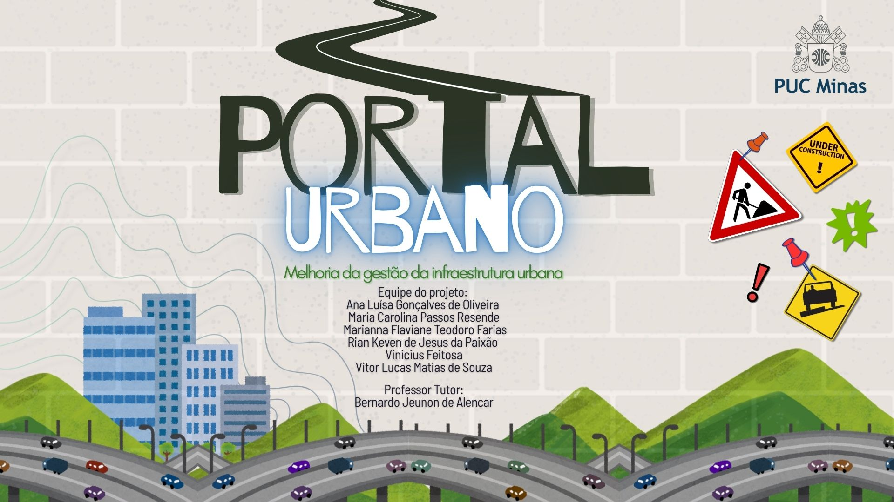
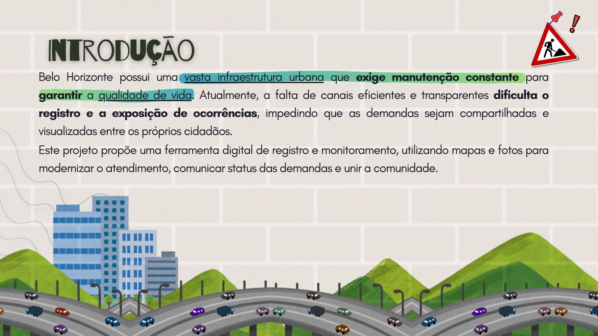
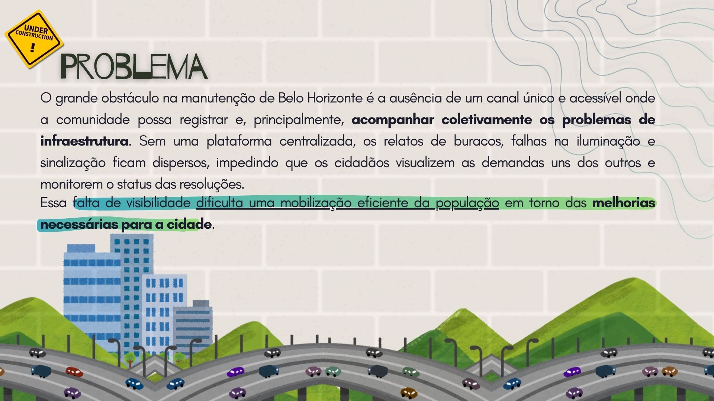
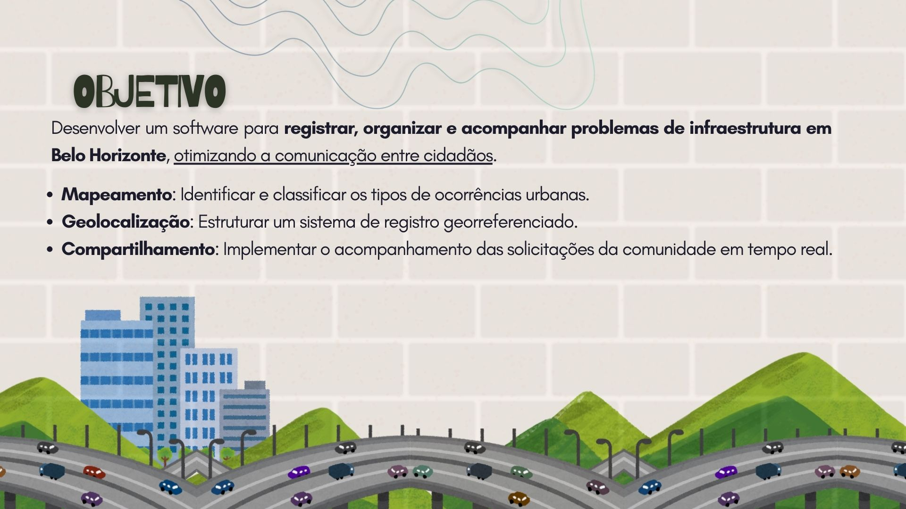
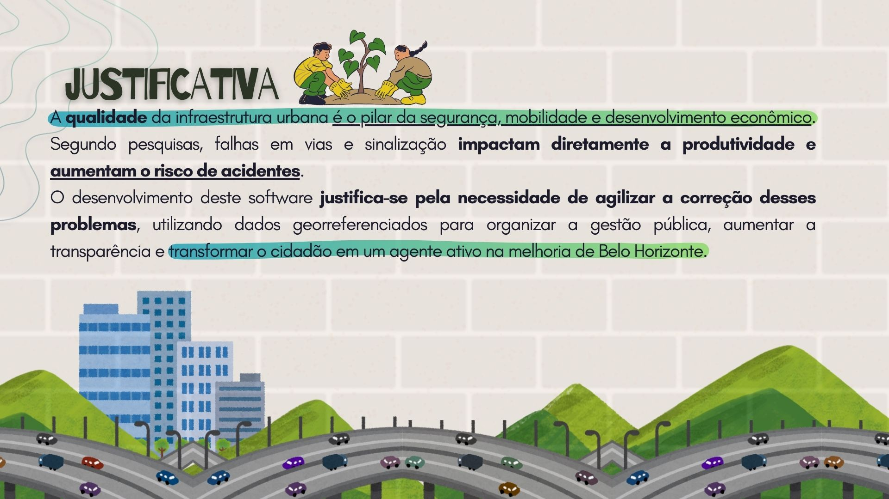
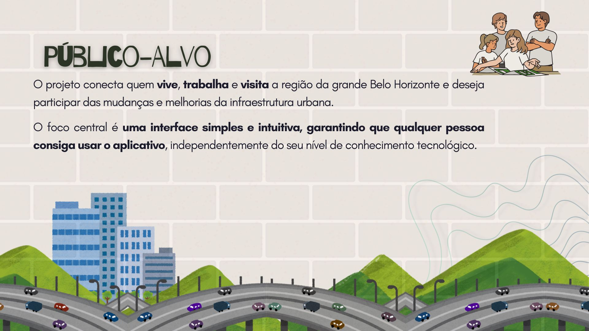

# Apresentação

Pré-requisitos: Todos os demais artefatos

## Título do Projeto

Portal Urbano

## Conjunto de Slides (Estrutura)

<!-- [SlidesPortalUrbano.zip](https://github.com/user-attachments/files/25806706/SlidesPortalUrbano.zip) -->

O grupo deve elaborar um conjunto de slides que registre, de forma organizada, todas as etapas desenvolvidas ao longo do semestre. Esse material deve contemplar a linha do tempo do projeto, desde a concepção inicial até os resultados finais, podendo incluir também _prints_ das telas da aplicação para ilustrar a entrega concluída.

Conjunto de Slides (Estrutura) - Etapa 01

Conjunto de Slides (Estrutura) - Etapa 05

## Vídeo de apresentação - Etapa 01

https://github.com/user-attachments/assets/ba4be4f0-b898-410c-a8aa-f4020f2bcef1

## Vídeo de apresentação - Etapa 05

Inclua aqui o vídeo de APRESENTAÇÃO FINAL do projeto produzido na Etapa 05.

### Orientações para Produção do Vídeo Pitch (Etapa 05)

https://github.com/user-attachments/assets/dbc49006-f8c5-4ead-b0a8-cc4e8e840f71

